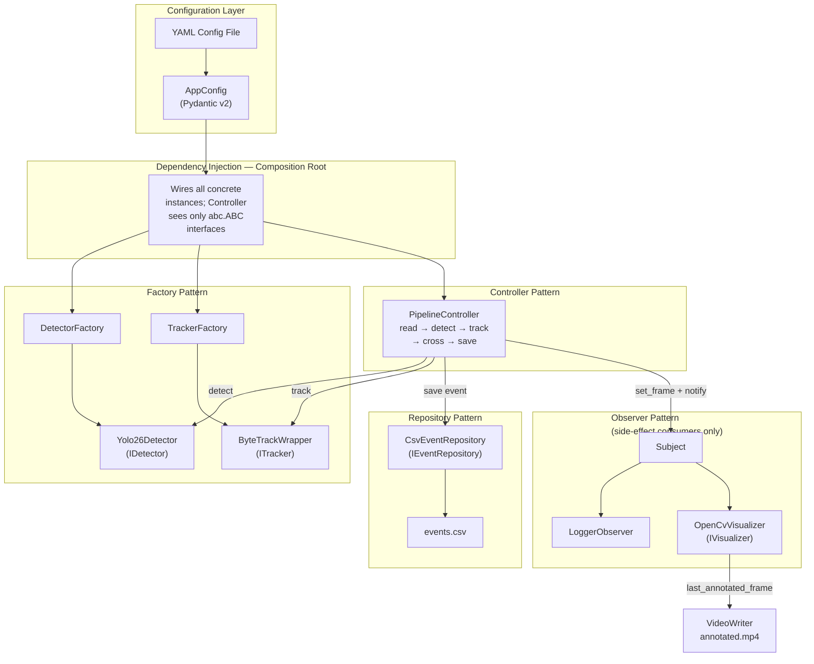
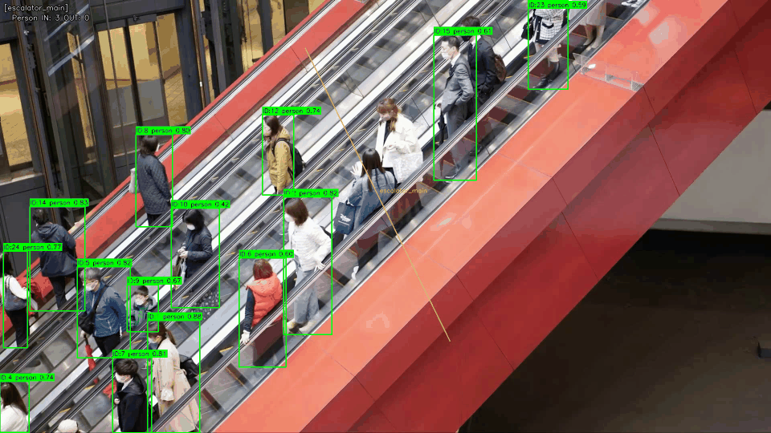
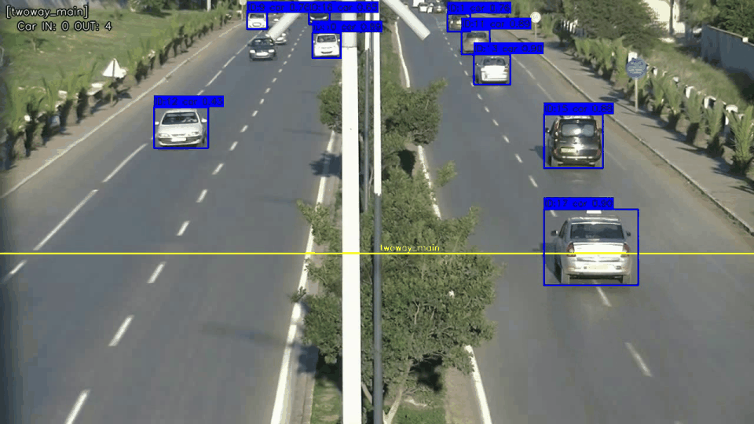
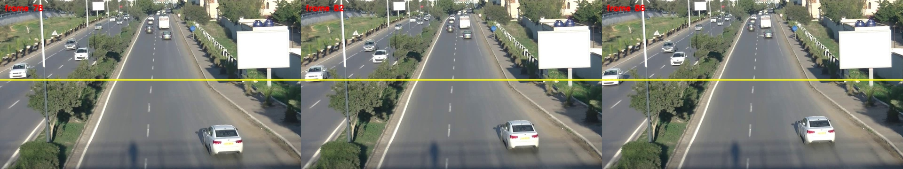
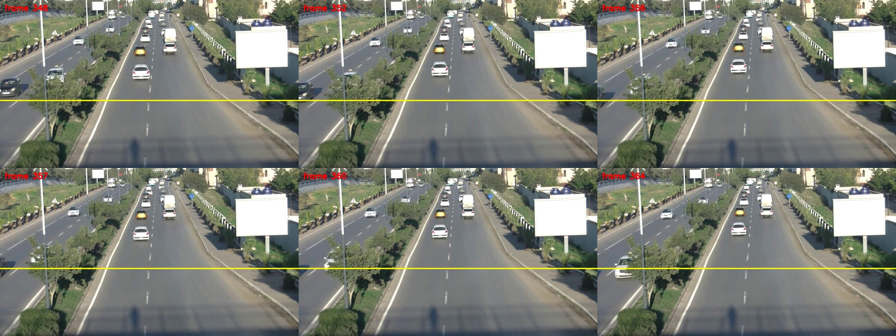

# Multi-Object Tracking and Directional Counting System

[](https://github.com/Cyber-Sutech-journal/magazine-03/actions/workflows/ai-ci.yml)
[](LICENSE)
[](https://www.python.org/downloads/)

A production-oriented, modular video analytics pipeline for fixed-camera object counting using
**YOLO26 + ByteTrack**. Built as part of the **Cyber Sutech Magazine 03** academic publication.

---

## Table of Contents

1. [Problem Statement](#1-problem-statement)
2. [Architecture Overview](#2-architecture-overview)
3. [Demos](#3-demos)
4. [Installation](#4-installation)
   - [Native — macOS / Linux](#native--macos--linux-bash-or-zsh)
   - [Native — Windows](#native--windows-powershell)
   - [Docker — CPU (all platforms)](#docker--cpu-profile-windows-macos-linux)
   - [Docker — GPU (NVIDIA only)](#docker--gpu-profile-optional-nvidia-only)
5. [Quick Start](#5-quick-start)
6. [Configuration Reference](#6-configuration-reference)
7. [Reproducing Published Results](#7-reproducing-published-results)
8. [Evaluation Results (T22)](#8-evaluation-results-t22)
9. [Failure Analysis](#9-failure-analysis)
10. [Ground Truth Annotation Tool](#10-ground-truth-annotation-tool)
11. [Continuous Integration](#11-continuous-integration)
12. [Citation](#12-citation)
13. [License](#13-license)

---

## 1. Problem Statement

Automated counting of people and vehicles crossing a virtual line in fixed-camera video is a
fundamental task in smart-city surveillance, crowd management, and traffic monitoring. Existing
solutions are often cloud-dependent, require bespoke hardware, or lack reproducible evaluation
pipelines that can be audited at the individual event level.

This project addresses the following problem:

> **Given a single recorded video from a fixed, stationary camera, detect and persistently track
> objects of interest (primarily `person` and `car`), determine when each track crosses one or more
> user-defined virtual counting lines, classify every crossing as `IN` or `OUT`, and log each event
> with rich metadata — while preventing duplicate counts and producing an annotated output video.**

Key design constraints:

- **No training or fine-tuning.** The detector uses a pretrained YOLO26 model.
- **Reproducible and auditable.** Every crossing event is time-stamped and stored in a CSV file
  that can be matched against manually annotated ground truth with a deterministic evaluator.
- **Configuration-driven.** No hard-coded thresholds, class names, or file paths anywhere in the
  source code.
- **Clean architecture.** Factory, Observer, Controller, and Repository patterns with manual
  dependency injection through `abc.ABC` interfaces — ensuring any module can be extended in
  isolation.
- **Containerised.** CPU and GPU Docker profiles produce identical results on all platforms.

**Inputs**

| Input | Description |
|---|---|
| Recorded video file | Fixed-camera clip in any OpenCV-readable format |
| YAML configuration file | Controls all runtime parameters (paths, classes, confidence, line geometry, tracker hyperparameters, etc.) |
| Ground truth CSV *(optional)* | For evaluation only; produced by `scripts/annotate_ground_truth.py` |

**Primary Outputs**

| Output | Description |
|---|---|
| `outputs/annotated.mp4` | Annotated video with bounding boxes, track IDs, counting lines, and live IN/OUT counters |
| `outputs/events.csv` | CSV log of every validated crossing event with frame index, timestamp, track ID, class, direction, line ID, confidence, and bounding-box coordinates |
| Final count summary | Printed to stdout and stored in `PipelineController.stats` after each run |
| `evaluation_summary.csv` / `evaluation_matches.csv` | Evaluation report when ground truth is provided |

**Non-goals (explicit scope boundaries)**

- No training or fine-tuning of the detector.
- No live / online camera streaming (recorded video only).
- No multi-camera fusion or 3-D tracking.
- No guaranteed re-identification across track ID switches (documented known limitation).
- No hard real-time performance guarantee; FPS is reported as an informational metric.

---

## 2. Architecture Overview

The system follows a clean, layered architecture with four explicit design patterns wired together
through a manual composition root using constructor-based dependency injection.



### Design Patterns at a Glance

| Pattern | Implementation | Location |
|---|---|---|
| **Factory** | `DetectorFactory` wraps a pre-loaded YOLO model into `Yolo26Detector`; `TrackerFactory` instantiates `ByteTrackWrapper` | `src/mot_counting/factories/` |
| **Observer** | `Subject.notify()` broadcasts to `LoggerObserver` and `OpenCvVisualizer` after each frame's core sequence completes. The `read → detect → track → cross` loop itself is a plain synchronous sequence — observers handle only side effects | `src/mot_counting/observers/` |
| **Controller** | `PipelineController` owns the full frame loop and lifecycle (`run`, `stop`, `cleanup`); it is injected with all dependencies and never imports concrete YOLO or ByteTrack classes | `src/mot_counting/controllers/` |
| **Repository** | `CsvEventRepository` and `InMemoryEventRepository` both implement `IEventRepository`; the controller only talks to the interface | `src/mot_counting/repositories/` |
| **DI — Composition Root** | `build_pipeline()` constructs every concrete instance and wires them together. No DI container — pure constructor injection via `abc.ABC` interfaces | `src/mot_counting/composition_root.py` |

### Module Map

```
src/mot_counting/
├── composition_root.py        # Composition root — DI wiring
├── config.py                  # Pydantic v2 AppConfig + YAML loader
├── types.py                   # Frozen dataclasses: Detection, Track, CrossingEvent, Direction
├── evaluation.py              # DP event matcher + metrics
├── interfaces/                # abc.ABC interfaces (IDetector, ITracker, ICrossingLogic, …)
├── factories/                 # DetectorFactory, TrackerFactory
├── detectors/                 # Yolo26Detector
├── trackers/                  # ByteTrackWrapper
├── crossing/                  # CrossingLogic (signed-distance, confirmed-side, history window)
├── repositories/              # CsvEventRepository, InMemoryEventRepository
├── visualizers/               # OpenCvVisualizer
├── controllers/               # PipelineController + RunStats
├── observers/                 # Subject, Observer base, LoggerObserver
└── utils/                     # geometry.py, video_io.py (OpenCvFrameSource)
```

### Crossing Logic

The crossing state machine (`crossing/crossing_logic.py`) is the core custom component:

- **Reference point:** `bottom_center` (default) or `box_center`.
- **Side formula:** `signed_distance = (B.x−A.x)·(P.y−A.y) − (B.y−A.y)·(P.x−A.x)` — positive on one side of the directed line A→B, negative on the other.
- **Confirmation:** a sliding history window (default 8 frames). A crossing is emitted only when the majority direction (≥ 70% of window by default) flips relative to the confirmed side, the cooldown has expired, and all optional safeguards pass.
- **Direction:** `positive_direction: A_to_B` means motion toward the `+1` side is `IN`; `B_to_A` inverts this.
- **Class attribution:** majority vote over the same history window.
- **Stale cleanup:** per-track state is discarded when the track has not been seen for `stale_track_timeout_seconds`.

---

## 3. Demos

| Scenario | Demo |
|---|---|
| Escalator — moderate-density pedestrian flow with partial occlusion |  |
| Two-way vehicle traffic |  |

---

## 4. Installation

All commands are run from `projects/artificial-intelligence/` (the directory that contains
`pyproject.toml`, `configs/`, and `Dockerfile`).

| Machine | Recommended path |
|---|---|
| Windows, macOS, Linux — no NVIDIA GPU | Native install **or** `docker-compose.cpu.yml` |
| Windows / Linux with NVIDIA GPU | Either; GPU Docker is faster but produces identical counts |

---

### Native — macOS / Linux (bash or zsh)

Requires Python 3.10+ (3.12 recommended).

```bash
git clone https://github.com/Cyber-Sutech-journal/magazine-03
cd magazine-03/projects/artificial-intelligence

python3 -m venv .venv
source .venv/bin/activate

pip install -e ".[dev]"
pre-commit install

# Download YOLO26 model weights (runs once — saves .pt files locally)
python -c "from ultralytics import YOLO; YOLO('yolo26n.pt'); YOLO('yolo26m.pt')"

# Smoke test with the synthetic CI clip
python scripts/run_pipeline.py --config configs/ci.yaml
```

Optional faster install with [uv](https://docs.astral.sh/uv/):

```bash
uv venv && uv pip install -e ".[dev]"
```

---

### Native — Windows (PowerShell)

Requires [Python 3.10+](https://www.python.org/downloads/) (3.12 recommended).
Quote `".[dev]"` so `[dev]` is not treated as a glob wildcard.

```powershell
git clone https://github.com/Cyber-Sutech-journal/magazine-03
cd magazine-03\projects\artificial-intelligence

py -3.12 -m venv .venv
.\.venv\Scripts\Activate.ps1
# If activation is blocked: Set-ExecutionPolicy -Scope CurrentUser RemoteSigned

pip install -e ".[dev]"
pre-commit install

python -c "from ultralytics import YOLO; YOLO('yolo26n.pt'); YOLO('yolo26m.pt')"

python scripts\run_pipeline.py --config configs\ci.yaml
```

---

### Docker — CPU profile (Windows, macOS, Linux)

No NVIDIA GPU required. Install [Docker Desktop](https://docs.docker.com/get-docker/)
(Windows/macOS) or Docker Engine (Linux). Compose V2 is included as `docker compose`.

**Before the first build**, `yolo26n.pt` and `yolo26m.pt` must exist in this folder (they are
copied into the image). If you already ran the native install they are present; otherwise:

```bash
pip install ultralytics
python -c "from ultralytics import YOLO; YOLO('yolo26n.pt'); YOLO('yolo26m.pt')"
```

```bash
# Build
docker compose -f docker-compose.cpu.yml build pipeline

# Verify weights are baked inside the image
docker run --rm --entrypoint ls mot-counting:cpu -lh /app/yolo26n.pt /app/yolo26m.pt

# Run CI smoke test
docker compose -f docker-compose.cpu.yml run --rm pipeline --config configs/ci.yaml

# Run unit tests inside the container
docker compose -f docker-compose.cpu.yml run --rm tests
```

Outputs land on the host at `outputs/annotated.mp4` and `outputs/events.csv`.

Override the video file at runtime without editing YAML:

```bash
docker compose -f docker-compose.cpu.yml run --rm pipeline \
    --config configs/default.yaml --video data/my_clip.mp4
```

---

### Docker — GPU profile (optional, NVIDIA only)

> **Do not use `--gpus all` on macOS or on any machine without an NVIDIA GPU.** That flag fails
> with `could not select device driver … capabilities: [[gpu]]`. Use the CPU profile instead.

CUDA is **speed only** — counts and events are identical to the CPU profile.

**Prerequisites (Linux):** NVIDIA driver ≥ 545 +
[nvidia-container-toolkit](https://docs.nvidia.com/datacenter/cloud-native/container-toolkit/latest/install-guide.html).

**Prerequisites (Windows):** NVIDIA GPU + Docker Desktop with WSL2 backend and GPU support enabled.

```bash
# Verify the host can pass the GPU into Docker (Linux / Windows+WSL2 only)
docker run --gpus all --rm nvidia/cuda:12.4.1-base-ubuntu22.04 nvidia-smi

# Build (linux/amd64 base; first build is large and slow)
docker compose -f docker-compose.gpu.yml build pipeline

# Run with GPU (NVIDIA host only)
docker compose -f docker-compose.gpu.yml run --rm --gpus all pipeline --config configs/ci.yaml

# CPU fallback smoke test using the GPU image (harmless NNPACK warning on Apple Silicon)
docker compose -f docker-compose.gpu.yml run --rm pipeline --config configs/ci.yaml
```

---

## 5. Quick Start

```bash
# Run the pipeline on the default clip
python scripts/run_pipeline.py --config configs/default.yaml

# Override the video path without editing YAML
python scripts/run_pipeline.py --config configs/default.yaml --video path/to/video.mp4

# Evaluate predictions against ground truth
python scripts/evaluate.py \
    --predictions outputs/events.csv \
    --ground-truth data/ground_truth.csv \
    --tolerance-seconds 0.5

# Create ground truth annotations for a new clip
python scripts/annotate_ground_truth.py --video data/clip.mp4 --output data/clip_gt.csv

# Multi-clip production run
python scripts/run_production.py \
    --config configs/production.yaml \
    --clips data/clip_a.mp4 data/clip_b.mp4 \
    --output-root outputs/production

# Docker CPU (all platforms)
docker compose -f docker-compose.cpu.yml run --rm pipeline --config configs/ci.yaml
```

---

## 6. Configuration Reference

All runtime parameters live in a YAML configuration file validated by Pydantic v2. No hard-coded
paths, thresholds, or class names exist anywhere in the source code.

### Full reference (`configs/default.yaml`)

```yaml
video:
  path: "data/ci_sample_clip.mp4"  # Path to input video
  output_dir: "outputs/"            # Directory for pipeline output files

detection:
  model_variant: "yolo26m"          # yolo26n | yolo26s | yolo26m | yolo26l | yolo26x
  imgsz: 640                        # Inference image size (positive integer)
  confidence_threshold: 0.4         # Global detection confidence (0, 1]
  classes: ["person", "car"]        # Must exist in YOLO model.names; unknown names fail fast

tracker:
  type: "bytetrack"                 # bytetrack (botsort: accepted by schema, raises NotImplementedError)
  track_thresh: 0.5                 # ByteTrack detection score threshold
  match_thresh: 0.8                 # ByteTrack IoU association threshold
  track_buffer: 30                  # Max frames to keep a lost track alive

lines:
  - line_id: "main_line"            # Unique string ID (duplicate IDs fail Pydantic validation)
    point_a: [100, 400]             # [x, y] start point — absolute pixels
    point_b: [800, 400]             # [x, y] end point — absolute pixels
    positive_direction: "A_to_B"    # A_to_B → motion to +1 side = IN | B_to_A inverts

crossing_logic:
  reference_point: "bottom_center"  # bottom_center | box_center
  history_length: 8                 # Sliding side-history window (frames, ≥ 1)
  confirmation_majority_threshold: 0.7  # Fraction of window required to be decisive (0.5, 1.0]
  cooldown_seconds: 1.5             # Min seconds between events per (track_id, line_id)
  stale_track_timeout_seconds: 2.0  # Remove state for tracks unseen this long
  min_displacement_px: null         # Minimum displacement safeguard (null = disabled)
  min_velocity_px_per_s: null       # Minimum velocity safeguard (null = disabled)

events:
  output_csv: "outputs/events.csv"

evaluation:
  matching_tolerance_seconds: 1.0   # Temporal tolerance for ground-truth matching

visualization:
  output_video: "outputs/annotated.mp4"
  draw_trails: false
```

### Configuration key reference

| Key | Type | Description | Default |
|---|---|---|---|
| `video.path` | string | Path to input video | `data/ci_sample_clip.mp4` |
| `video.output_dir` | string | Directory for pipeline outputs | `outputs/` |
| `detection.model_variant` | string | YOLO26 variant | `yolo26m` |
| `detection.imgsz` | int | Inference image size | `640` |
| `detection.confidence_threshold` | float | Global detection threshold | `0.4` |
| `detection.classes` | list[str] | Class names to detect | `["person", "car"]` |
| `tracker.type` | string | Tracker backend | `bytetrack` |
| `tracker.track_thresh` | float | ByteTrack detection threshold | `0.5` |
| `tracker.match_thresh` | float | ByteTrack association threshold | `0.8` |
| `tracker.track_buffer` | int | Max frames to keep a lost track | `30` |
| `lines[].line_id` | string | Unique counting line identifier | — |
| `lines[].point_a` | [int, int] | Start point in absolute pixels | — |
| `lines[].point_b` | [int, int] | End point in absolute pixels | — |
| `lines[].positive_direction` | string | `A_to_B` or `B_to_A` | `A_to_B` |
| `crossing_logic.reference_point` | string | `bottom_center` or `box_center` | `bottom_center` |
| `crossing_logic.history_length` | int | History window size (frames) | `8` |
| `crossing_logic.confirmation_majority_threshold` | float | Majority fraction for confirmation | `0.7` |
| `crossing_logic.cooldown_seconds` | float | Min seconds between events per (track, line) | `1.5` |
| `crossing_logic.stale_track_timeout_seconds` | float | State timeout for unseen tracks | `2.0` |
| `crossing_logic.min_displacement_px` | float \| null | Displacement safeguard | `null` |
| `crossing_logic.min_velocity_px_per_s` | float \| null | Velocity safeguard | `null` |
| `events.output_csv` | string | Crossing-event CSV output path | `outputs/events.csv` |
| `evaluation.matching_tolerance_seconds` | float | Temporal tolerance for GT matching | `1.0` |
| `visualization.output_video` | string | Annotated video output path | `outputs/annotated.mp4` |
| `visualization.draw_trails` | bool | Draw trajectory trails | `false` |

### Shipped configuration files

| File | Purpose |
|---|---|
| `configs/default.yaml` | Default config (`yolo26m`, `imgsz: 640`) |
| `configs/ci.yaml` | CI/integration config (`yolo26n`, fast) |
| `configs/production.yaml` | Multi-clip production base (`yolo26m`; paths overridden by `run_production.py`) |
| `configs/examples/multi_line.yaml` | Two independent counting lines example (`entrance` / `exit`) |
| `configs/eval_escalator.yaml` | Evaluation config for the escalator clip |
| `configs/eval_mnd_back.yaml` | Evaluation config for MND Back 14–28 s |
| `configs/eval_twoway.yaml` | Evaluation config for TwoWay |
| `configs/eval_virat.yaml` | Evaluation config for VIRAT |
| `configs/eval_mnd_61_79.yaml` | Evaluation config for MND 61–79 s |

> `configs/ci.yaml` uses `yolo26n` for CI speed. All published magazine results use `yolo26m`
> via the `eval_*.yaml` configs (`imgsz: 960`, `confidence_threshold: 0.35`).

### Output file schema (`events.csv`)

| Column | Description |
|---|---|
| `frame_idx` | Zero-based frame index of the confirmation frame |
| `timestamp_seconds` | `frame_idx / fps` (0.0 if fps ≤ 0) |
| `track_id` | ByteTrack persistent track ID |
| `class_id` | YOLO class integer ID |
| `class_name` | Majority-voted class name over the history window |
| `direction` | `IN` or `OUT` |
| `line_id` | Counting line identifier from config |
| `confidence` | Track score on the confirmation frame |
| `bbox` | `"x1,y1,x2,y2"` bounding box on the confirmation frame |
| `video_name` | Source video name (not populated by the pipeline in v1) |

---

## 7. Reproducing Published Results

All published results from the magazine article use the five evaluation clips below with the frozen
production configuration (`yolo26m`, `imgsz: 960`, `confidence_threshold: 0.35`) and a temporal
matching tolerance of **0.5 s**.

### Step 1 — Obtain the evaluation clips

The video clips are not stored in this repository. Place them at the paths below before running:

| Config | Expected video path |
|---|---|
| `configs/eval_escalator.yaml` | `data/escalator_0_9s.mp4` |
| `configs/eval_mnd_back.yaml` | `data/BackVehcilesTraffic720p_14_28s.avi` |
| `configs/eval_twoway.yaml` | `data/TwoWayTraffic720p_shift05s.mp4` |
| `configs/eval_virat.yaml` | `data/VIRAT_S_010204_05_000856_000890_trim4s.mp4` |
| `configs/eval_mnd_61_79.yaml` | `data/BackVehcilesTraffic720p_61_79s.avi` |

Ground truth CSV files are already in `data/ground_truth/`.

### Step 2 — Install

```bash
pip install -e ".[dev]"
python -c "from ultralytics import YOLO; YOLO('yolo26m.pt')"
```

### Step 3 — Run the production pipeline for each clip

```bash
python scripts/run_production.py \
    --config configs/eval_escalator.yaml \
    --clips data/escalator_0_9s.mp4 \
    --output-root outputs/final_escalator

python scripts/run_production.py \
    --config configs/eval_mnd_back.yaml \
    --clips data/BackVehcilesTraffic720p_14_28s.avi \
    --output-root outputs/final_mnd_back

python scripts/run_production.py \
    --config configs/eval_twoway.yaml \
    --clips data/TwoWayTraffic720p_shift05s.mp4 \
    --output-root outputs/final_twoway

python scripts/run_production.py \
    --config configs/eval_virat.yaml \
    --clips data/VIRAT_S_010204_05_000856_000890_trim4s.mp4 \
    --output-root outputs/final_virat

python scripts/run_production.py \
    --config configs/eval_mnd_61_79.yaml \
    --clips data/BackVehcilesTraffic720p_61_79s.avi \
    --output-root outputs/final_mnd_61_79
```

### Step 4 — Evaluate each clip against ground truth

Use `--tolerance-seconds 0.5` for all clips to reproduce the published metrics exactly.

```bash
python scripts/evaluate.py \
    --predictions outputs/final_escalator/escalator_0_9s/escalator_0_9s_events.csv \
    --ground-truth data/ground_truth/escalator_gt.csv \
    --tolerance-seconds 0.5 --output-dir outputs/evaluation/escalator

python scripts/evaluate.py \
    --predictions outputs/final_mnd_back/BackVehcilesTraffic720p_14_28s/BackVehcilesTraffic720p_14_28s_events.csv \
    --ground-truth data/ground_truth/mnd_back_gt.csv \
    --tolerance-seconds 0.5 --output-dir outputs/evaluation/mnd_back

python scripts/evaluate.py \
    --predictions outputs/final_twoway/TwoWayTraffic720p_shift05s/TwoWayTraffic720p_shift05s_events.csv \
    --ground-truth data/ground_truth/twoway_gt.csv \
    --tolerance-seconds 0.5 --output-dir outputs/evaluation/twoway

python scripts/evaluate.py \
    --predictions outputs/final_virat/VIRAT_S_010204_05_000856_000890_trim4s/VIRAT_S_010204_05_000856_000890_trim4s_events.csv \
    --ground-truth data/ground_truth/virat_gt.csv \
    --tolerance-seconds 0.5 --output-dir outputs/evaluation/virat

python scripts/evaluate.py \
    --predictions outputs/final_mnd_61_79/BackVehcilesTraffic720p_61_79s/BackVehcilesTraffic720p_61_79s_events.csv \
    --ground-truth data/ground_truth/mnd_61_79_gt.csv \
    --tolerance-seconds 0.5 --output-dir outputs/evaluation/mnd_61_79
```

Each output directory will contain `evaluation_summary.csv` and `evaluation_matches.csv`.
Expected aggregate: **Precision 1.0000 · Recall 0.9474 · F1 0.9730** (see §8).

### Docker alternative for Step 3

```bash
docker compose -f docker-compose.cpu.yml build pipeline

docker run --rm --entrypoint python \
    -v "$(pwd)/configs:/app/configs:ro" \
    -v "$(pwd)/data:/app/data:ro" \
    -v "$(pwd)/outputs:/app/outputs" \
    mot-counting:cpu \
    scripts/run_production.py \
        --config configs/eval_escalator.yaml \
        --clips data/escalator_0_9s.mp4 \
        --output-root outputs/final_escalator
```

### Counting-line geometry used in evaluation

| Config | Line ID | Point A | Point B | Positive direction |
|---|---|---|---|---|
| `eval_escalator.yaml` | `escalator_main` | `(760, 120)` | `(1120, 850)` | `A_to_B` |
| `eval_mnd_back.yaml` | `mnd_back_main` | `(0, 340)` | `(1279, 340)` | `A_to_B` |
| `eval_twoway.yaml` | `twoway_main` | `(0, 430)` | `(1279, 430)` | `A_to_B` |
| `eval_virat.yaml` | `virat_main` | `(660, 530)` | `(935, 370)` | `A_to_B` |
| `eval_mnd_61_79.yaml` | `mnd_61_79_main` | `(0, 430)` | `(1279, 430)` | `A_to_B` |

---

## 8. Evaluation Results (T22)

> The results below are the finalized T22 evaluation outputs authored by **Armila** (AI Section
> Lead / Evaluation & Quality Lead). These numbers are reproduced exactly from
> [`docs/evaluation-results.md`](docs/evaluation-results.md) and must not be altered.

Full report: [`docs/evaluation-results.md`](docs/evaluation-results.md)

### Evaluation set

| Clip | Primary class | Scenario | Frames | Duration |
|---|---|---|---:|---:|
| `escalator_0_9s.mp4` | `person` | Moderate-density pedestrian flow with partial occlusion | 216 | 9.00 s |
| `BackVehcilesTraffic720p_14_28s.avi` | `car` | Vehicle traffic with both IN and OUT crossings | 350 | 14.00 s |
| `TwoWayTraffic720p_shift05s.mp4` | `car` | Bidirectional vehicle traffic | 477 | 19.08 s |
| `VIRAT_S_010204_05_000856_000890_trim4s.mp4` | `person` | Low-density pedestrian movement | 488 | 20.36 s |
| `BackVehcilesTraffic720p_61_79s.avi` | `car` | More demanding vehicle flow with closely spaced crossings | 450 | 18.00 s |

**Total frames processed: 1,981.**

### Frozen production configuration

```yaml
detection:
  model_variant: "yolo26m"
  imgsz: 960
  confidence_threshold: 0.35

tracker:
  type: "bytetrack"
  track_thresh: 0.5
  match_thresh: 0.8
  track_buffer: 30

crossing_logic:
  reference_point: "bottom_center"
  history_length: 8
  confirmation_majority_threshold: 0.7
  cooldown_seconds: 1.5
  stale_track_timeout_seconds: 2.0

evaluation:
  matching_tolerance_seconds: 0.5
```

No production settings were changed between clips in response to evaluation results.

### Aggregate results

| Metric | Value |
|---|---:|
| Ground Truth events | 57 |
| Predicted events | 54 |
| True Positives (TP) | 54 |
| False Positives (FP) | 0 |
| False Negatives (FN) | 3 |
| **Precision** | **1.0000** |
| **Recall** | **0.9474** |
| **F1** | **0.9730** |
| Absolute counting error | 3 |
| Percentage counting error | 5.26% |

No false-positive crossing events were observed. All event-level errors were missed crossings.

### Per-clip results

| Clip | GT | Predicted | TP | FP | FN | Precision | Recall | F1 | Count error % |
|---|---:|---:|---:|---:|---:|---:|---:|---:|---:|
| Escalator | 8 | 8 | 8 | 0 | 0 | 1.0000 | 1.0000 | 1.0000 | 0.00% |
| MND Back 14–28 s | 12 | 12 | 12 | 0 | 0 | 1.0000 | 1.0000 | 1.0000 | 0.00% |
| TwoWay | 15 | 15 | 15 | 0 | 0 | 1.0000 | 1.0000 | 1.0000 | 0.00% |
| VIRAT | 5 | 5 | 5 | 0 | 0 | 1.0000 | 1.0000 | 1.0000 | 0.00% |
| **MND 61–79 s** | **17** | **14** | **14** | **0** | **3** | **1.0000** | **0.8235** | **0.9032** | **17.65%** |

### Per-direction and per-group results

| Line / class / direction | GT | Predicted | TP | FP | FN | Precision | Recall | F1 | Count error % |
|---|---:|---:|---:|---:|---:|---:|---:|---:|---:|
| `escalator_main / person / IN` | 8 | 8 | 8 | 0 | 0 | 1.0000 | 1.0000 | 1.0000 | 0.00% |
| `mnd_back_main / car / IN` | 8 | 8 | 8 | 0 | 0 | 1.0000 | 1.0000 | 1.0000 | 0.00% |
| `mnd_back_main / car / OUT` | 4 | 4 | 4 | 0 | 0 | 1.0000 | 1.0000 | 1.0000 | 0.00% |
| `twoway_main / car / IN` | 5 | 5 | 5 | 0 | 0 | 1.0000 | 1.0000 | 1.0000 | 0.00% |
| `twoway_main / car / OUT` | 10 | 10 | 10 | 0 | 0 | 1.0000 | 1.0000 | 1.0000 | 0.00% |
| `virat_main / person / IN` | 2 | 2 | 2 | 0 | 0 | 1.0000 | 1.0000 | 1.0000 | 0.00% |
| `virat_main / person / OUT` | 3 | 3 | 3 | 0 | 0 | 1.0000 | 1.0000 | 1.0000 | 0.00% |
| `mnd_61_79_main / car / IN` | 5 | 2 | 2 | 0 | 3 | 1.0000 | 0.4000 | 0.5714 | 60.00% |
| `mnd_61_79_main / car / OUT` | 12 | 12 | 12 | 0 | 0 | 1.0000 | 1.0000 | 1.0000 | 0.00% |

The performance reduction is fully localised to the `car / IN` group in the MND 61–79 s clip. The
corresponding `car / OUT` flow in the same clip was fully matched.

### Representative evaluation images

True-positive example (MND Back):



Failure example (MND 61–79 s — missed `car / IN`):



### Runtime (CPU)

| Clip | Frames | Processing time | Avg FPS |
|---|---:|---:|---:|
| Escalator | 216 | 145.3 s | 1.49 |
| MND Back 14–28 s | 350 | 392.6 s | 0.89 |
| TwoWay | 477 | 405.8 s | 1.18 |
| VIRAT | 488 | 225.2 s | 2.17 |
| MND 61–79 s | 450 | 208.5 s | 2.16 |
| **Total** | **1,981** | **1,377.3 s** | **≈ 1.44** |

Execution environment: Windows 11 · Intel Core i5-13500H · CPU mode · Python 3.12.0 ·
PyTorch 2.13.0+cpu · Ultralytics 8.4.128 · OpenCV 4.11.0.

> These measurements characterise the CPU evaluation environment. GPU deployment is expected
> to achieve significantly higher throughput.

---

## 9. Failure Analysis

> The following failure analysis is part of the finalized T22 evaluation, authored by **Armila**.
> Numbers are reproduced exactly from [`docs/evaluation-results.md`](docs/evaluation-results.md).

All three false negatives were concentrated in the **MND 61–79 s** clip, specifically the
`car / IN` direction. The corresponding `car / OUT` flow in the same clip was fully matched (12/12).

### False-negative summary

| GT frame | Time | Failure pattern | Likely subsystem | Effect |
|---:|---:|---|---|---|
| 167 | 6.68 s | Stable detection and track across line — no `IN` event emitted | Crossing Logic | 1 FN |
| 182 | 7.28 s | Occlusion by tree, lost bbox, track ID switch `19 → 22` | Tracking | 1 FN |
| 352 | 14.08 s | Stable detection and track across line — no `IN` event emitted | Crossing Logic | 1 FN |

### Failure mode 1 — Crossing Logic miss despite stable tracking

At GT frames 167 (6.68 s) and 352 (14.08 s) the vehicle remained **detected, retained a stable
track ID, and crossed the configured counting line** without a visible interruption. Because
detection and track continuity were present, the most likely failure region is the **Crossing
Logic** — specifically crossing confirmation or event generation.

The GT event at frame 352 occurred only 0.32 s before another GT event at frame 360. Production
emitted one `IN` event at frame 357, which the one-to-one DP assignment matched to GT frame 360,
leaving GT frame 352 unmatched. The available evidence establishes two separate physical crossings
and one emitted production event.

### Failure mode 2 — Occlusion-related track fragmentation

At GT frame 182 (7.28 s) the vehicle was occluded by a tree before reaching the line, losing its
bounding box during the occlusion interval. Before occlusion: **track ID 19**. After reappearing
beyond the line: **track ID 22**. The crossing therefore occurred while continuous tracking
information was unavailable — consistent with **Tracking** failure through occlusion-related
detection loss and ID reassignment.

### Stress observations across the set

The remaining four clips produced complete event matches (F1 = 1.0000) across: moderate-density
pedestrian flow with partial occlusion (Escalator), vehicle traffic with both directions (MND Back),
bidirectional vehicle movement (TwoWay), and low-density pedestrian movement (VIRAT). The three
errors were concentrated in the more demanding incoming-flow portion of MND 61–79 s, not distributed
across the tested scenarios.

### Two concrete areas for future robustness work

1. Preserve crossing-event generation when detection and tracking remain stable across the boundary.
2. Maintain track continuity through occlusion to avoid fragmentation and ID reassignment.

---

## 10. Ground Truth Annotation Tool

Use `scripts/annotate_ground_truth.py` to create manual ground-truth annotations for video
line-crossing events. The tool is fully independent of the pipeline and uses only OpenCV.

```bash
# Linux / macOS
python scripts/annotate_ground_truth.py \
    --video data/clip.mp4 \
    --output data/clip_gt.csv

# Windows (PowerShell)
python .\scripts\annotate_ground_truth.py `
    --video ".\data\clip.mp4" `
    --output ".\data\clip_gt.csv"
```

### Frame accuracy

To prevent frame drift on inter-frame-compressed video (H.264), the tool uses sequential
`capture.read()` during normal playback and forward steps. `CAP_PROP_POS_FRAMES` seeking is used
only when stepping backward.

### Keyboard controls

| Key | Action |
|---|---|
| `Space` | Pause or resume playback |
| `Right Arrow` | Step one frame forward and pause |
| `Left Arrow` | Step one frame backward and pause |
| `M` | Mark a crossing on the currently displayed frame |
| `U` | Remove the most recently added annotation |
| `Q` or `Esc` | Save annotations and exit |

When **M** is pressed the tool prompts in the terminal for `class_name`, `direction` (`IN`/`OUT`),
and `line_id`. Empty class or line, or invalid direction, cancels the mark.

### Output CSV schema

```
frame_idx, timestamp_seconds, class_name, direction, line_id, video_name
```

- `frame_idx` is zero-based.
- `timestamp_seconds` = `round(frame_idx / fps, 6)` (annotator FPS fallback: 25.0).
- Each marked crossing produces exactly one row.

Ground truth files for the five T22 evaluation clips are in `data/ground_truth/`.

---

## 11. Continuous Integration

Every pull request into `ai-develop` must pass GitHub Actions before merge. The workflow is
`.github/workflows/ai-ci.yml` at the **magazine-03 repository root**. See
[`.github/workflows/README.md`](.github/workflows/README.md).

| Job | Command |
|---|---|
| Lint and format (Ruff) | `ruff check` + `ruff format --check` |
| Type check (mypy) | `mypy src/mot_counting` |
| Unit tests | `pytest tests/unit/` |
| Docker CPU integration | Build CPU image; run `configs/ci.yaml`; assert non-empty `outputs/annotated.mp4` and `outputs/events.csv` |

GPU is not run in CI. The CI clip is synthetic/CC0 — see [`docs/ci-sample-clip.md`](docs/ci-sample-clip.md).

### Running CI checks locally

```bash
ruff check .
ruff format --check .
mypy src/mot_counting
pytest tests/unit/

# Integration test (requires real yolo26n.pt + data/ci_sample_clip.mp4)
pytest tests/integration/ -m integration
```

---

## 12. Citation

If you use this system or its evaluation results in your work, please cite:

```bibtex
@article{cybersutech2026mot,
  title   = {Multi-Object Tracking and Directional Counting System
             for Fixed-Camera Video Analytics},
  author  = {Mashhadizadeh, Mostafa and Armila and Farzad and Amirmohammad},
  journal = {Cyber Sutech Magazine},
  volume  = {3},
  year    = {2026},
  url     = {https://github.com/Cyber-Sutech-journal/magazine-03}
}
```

---

## 13. License

The source code of this project is licensed under the **MIT License** — see the [`LICENSE`](LICENSE)
file for the full text.

### Third-Party Licensing Notice — Ultralytics YOLO26 (AGPL-3.0)

This project depends on the [`ultralytics`](https://github.com/ultralytics/ultralytics) package,
which is separately licensed under the **GNU Affero General Public License v3.0 (AGPL-3.0)** by
Ultralytics. The MIT license above covers only this project's own source code, **not** the
`ultralytics` dependency.

Because this project — its code, configurations, and outputs — is published publicly and completely
as an open-source academic repository, using `ultralytics` under AGPL-3.0 is fully permitted at no
cost. No Ultralytics Enterprise License is required for this use case.

**If you wish to reuse the `ultralytics` dependency itself** in your own work, you must independently
comply with its AGPL-3.0 license (or obtain your own Ultralytics Enterprise License). This is
independent of this project's MIT license.

An Enterprise License would only be required if any part of a downstream product built on
`ultralytics` were kept closed-source or deployed commercially without publishing the corresponding
source code — which is explicitly out of scope for this academic project.

For the full AGPL-3.0 text, see: <https://www.gnu.org/licenses/agpl-3.0.html>
